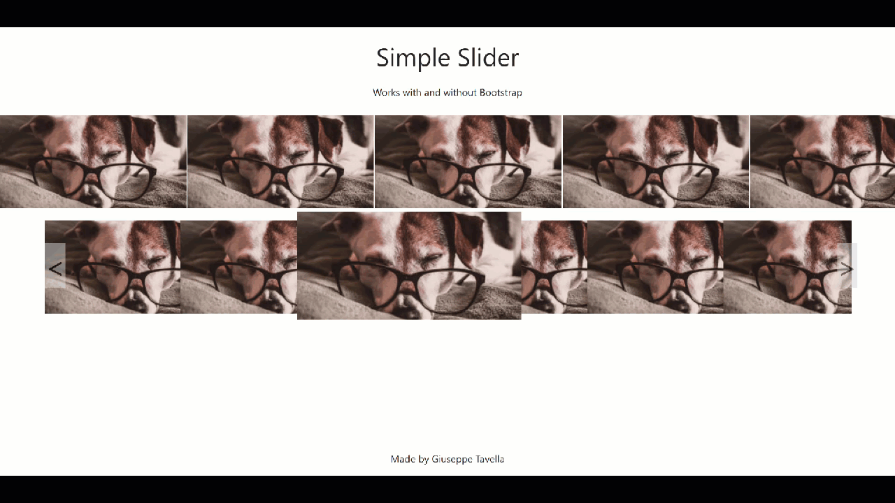

## Simple Slider

UI Component to create a Netflix-like Slider.



Made with JavaScript and Bootstrap.

HTML

```html
<div class="slider" id="slider1">
  <div class="cards">
    <!-- the cards will be populated by javascript -->
  </div>
</div>
```

JS

```js
const slider1 = new Slider({
  targetSelector: "#slider1",
  scrollBy: 250,
});
```